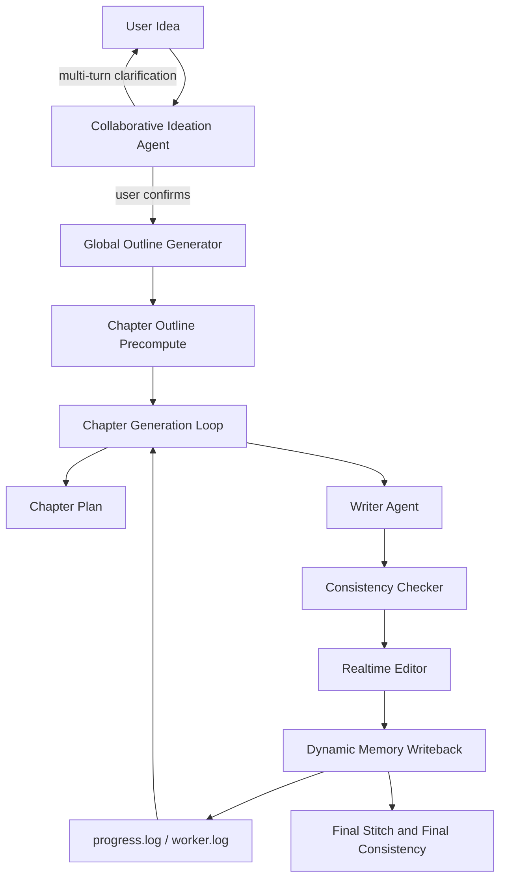
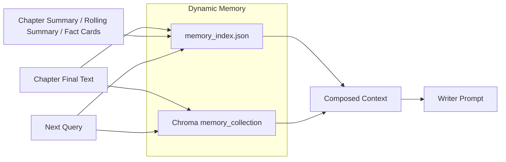

# CoLong Idea Studio

<div align="center">

**A Collaborative, Dynamic-Memory-First Framework for Long-Form Creative Ideation and Story Generation**


</div>

## Abstract

`CoLong Idea Studio` is a collaborative system for long-form creative writing that unifies idea refinement, outline planning, chapter generation, and dynamic memory management in a single workflow. The project is motivated by a common failure mode in long-text generation: users often begin with a promising but underspecified idea, while the model begins writing too early and accumulates structural drift, character inconsistency, and unstable chapter pacing.

To address this, the system combines two core mechanisms:

- a **collaborative ideation agent** that interacts with the user through multi-turn clarification until the idea is judged ready by the user;
- a **dynamic-memory-first generation pipeline** that stores outlines, summaries, character constraints, world rules, plot points, and fact cards as the story evolves.

The current implementation emphasizes observability, user-in-the-loop control, outline-grounded chapter planning, and deployment-oriented runtime packaging.

---

## Motivation

Long-form generation systems frequently underperform for three reasons:

1. The initial prompt is too coarse relative to the complexity of novel-scale writing.
2. Static retrieval alone is insufficient for maintaining evolving story state.
3. Automatic scoring often optimizes for local quality while harming completion and controllability.

`CoLong Idea Studio` is designed around a different assumption: **before writing long text, the system should first co-develop the creative specification with the user**. Once the user confirms that specification, generation proceeds with memory-grounded continuity rather than score-gated stopping.

---

## Contributions

1. **Collaborative Ideation Before Generation**
   - Introduces a dedicated ideation copilot agent for multi-turn clarification.
   - Terminates ideation only when the user explicitly confirms readiness.

2. **Dynamic-Memory-First Long-Text Pipeline**
   - Prioritizes dynamic memory over static RAG.
   - Persists structured artifacts such as outlines, chapter summaries, fact cards, character cards, and world-setting notes.

3. **Outline-Anchored Chapter Control**
   - Infers chapter length bounds from chapter/global outlines before fallback heuristics.
   - Pushes length constraints into writer prompts instead of relying solely on environment variables.

4. **Completion-First Execution Policy**
   - Removes reward-score stopping from the main chapter loop.
   - Prioritizes finishing planned chapters while recording warnings rather than forcing rewrite loops.

5. **Observable Production Workflow**
   - Uses `progress.log` and live worker logs as first-class runtime signals.
   - Exposes memory snapshots and chapter progress through the web portal.

---

## System Overview





---

## Collaborative Ideation Agent

The collaborative ideation stage is treated as an explicit agentic phase rather than a UI convenience feature.

### Objective

The ideation agent transforms an underspecified user idea into a generation-ready creative brief by iteratively asking targeted questions about:

- central conflict;
- protagonist motivation;
- relationship structure;
- world rules and genre commitments;
- chapter scale, pacing, and tone.

### Interaction Policy

- Each turn returns: `analysis`, `refined_idea`, `questions`, `readiness`, and `ready_hint`.
- The number of turns is **not fixed**.
- The session ends only when the **user explicitly confirms** that the idea is ready.

### Design Rationale

This design makes ideation a controllable collaborative process rather than an opaque preprocessing step. It preserves user agency while still allowing the model to impose structure where the original idea is incomplete.

---

## Methodology

### Chapter Length Bound Inference

For chapter `t`, the system applies the following priority:

1. Parse explicit length ranges from the chapter outline.
2. If unavailable, parse explicit length ranges from the global outline.
3. Otherwise, fall back to `0.9 * chapter_target` to `1.12 * chapter_target`.

Recognized expressions include:

- `3200-3600字`
- `3200~3600字`
- `每章约3300字`

### Dynamic Context Construction

Prompt context is composed from:

1. rolling summary;
2. recent chapter summaries;
3. recent fact cards;
4. semantic retrieval over dynamic memory vectors;
5. optional character/world/outline grouping.

### Completion-First Generation

The main loop is intentionally not score-gated. If a chapter exceeds the expected range, the system records `chapter_length_warning` instead of treating the warning as a mandatory rewrite trigger.

---

## Logging and Observability

`progress.log` is stored at:

```text
runs/<run_id>/progress.log
```

Representative event types include:

- `global_outline`
- `chapter_outline_ready`
- `chapter_plan`
- `chapter_outline`
- `chapter_length_plan`
- `chapter_length_warning`
- `character_setting`
- `world_setting`
- `memory_snapshot`

The web portal also exposes live worker logs, chapter outputs, and memory counters for production monitoring.

---

## Interface Overview

The deployed portal is organized into three interface layers:

1. **Dashboard**
   - provider management;
   - direct job creation;
   - collaborative ideation entry;
   - session/job overview.

2. **Collaborative Ideation View**
   - original idea;
   - refined idea draft;
   - latest analytical feedback;
   - next-round questions;
   - user confirmation trigger.

3. **Generation Monitor**
   - live worker output;
   - structured progress log;
   - chapter result snapshots;
   - runtime progress indicators.

This split is deliberate: ideation, generation, and monitoring are treated as distinct but connected phases.

---

## Runtime Profile

| Key | Default | Meaning |
|---|---|---|
| `MEMORY_ONLY_MODE` | `1` | dynamic-memory-only runtime |
| `ENABLE_RAG` | `0` | static/general RAG disabled |
| `ENABLE_STATIC_KB` | `0` | static KB disabled |
| `ENABLE_EVALUATOR` | `0` | evaluator disabled by default |
| `MIN_CHAPTER_CHARS` | `3000` | fallback lower bound |
| `MAX_CHAPTER_CHARS` | `0` | no global hard cap |

---

## Repository Structure

```text
.
├─ agents/                  # collaborative and generation agents
├─ workflow/                # analyzer / organizer / executor
├─ rag/                     # dynamic memory and retrieval
├─ utils/                   # llm client and support utilities
├─ local_web_portal/        # multi-user FastAPI portal
├─ config.py                # runtime configuration
└─ main.py                  # CLI entry
```

---

## Quick Start

### CLI

```bash
python -m venv .venv
# Windows
.venv\Scripts\activate
# Linux/macOS
# source .venv/bin/activate

python -m pip install --upgrade pip
python -m pip install -r requirements.txt
python main.py
```

### Web Portal

```bash
python -m pip install -r requirements.txt
python -m pip install -r local_web_portal/requirements.txt
# Windows
copy local_web_portal\.env.example local_web_portal\.env
# Linux/macOS
# cp local_web_portal/.env.example local_web_portal/.env
python -m uvicorn local_web_portal.app.main:app --host 0.0.0.0 --port 8010
```

---

## Deployment Principle

For production deployment, use a strict whitelist package and exclude:

- `runs/*`
- `vector_db/*`
- `vector_db_tmp/*`
- `local_web_portal/data/*`
- `.venv/*`
- `__pycache__/*`

This keeps deployment reproducible, lightweight, and safer for shared environments.

---

## Limitations

1. Prompt-level length control is strong but still probabilistic.
2. Dynamic memory quality depends on summary quality and retrieval relevance.
3. Collaborative ideation improves control, but does not eliminate downstream model variance.
4. End-to-end latency remains affected by multiple post-writing stages such as consistency checks, summaries, and vector writes.

---

## Citation

```bibtex
@software{colong_idea_studio_2026,
  title        = {CoLong Idea Studio: A Collaborative Dynamic-Memory-First Framework for Long-Form Creative Ideation and Story Generation},
  author       = {xiao-zi-chen and contributors},
  year         = {2026},
  url          = {https://github.com/xiao-zi-chen/Long-Story-agent}
}
```
