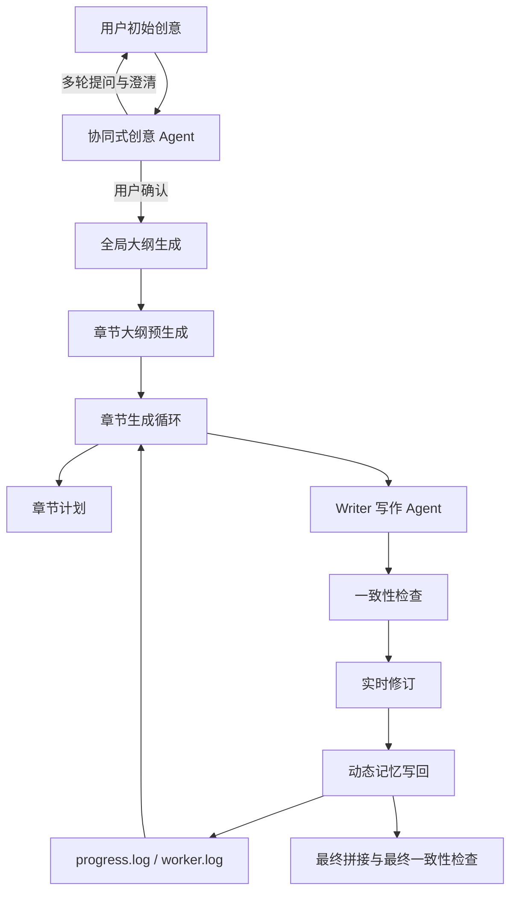
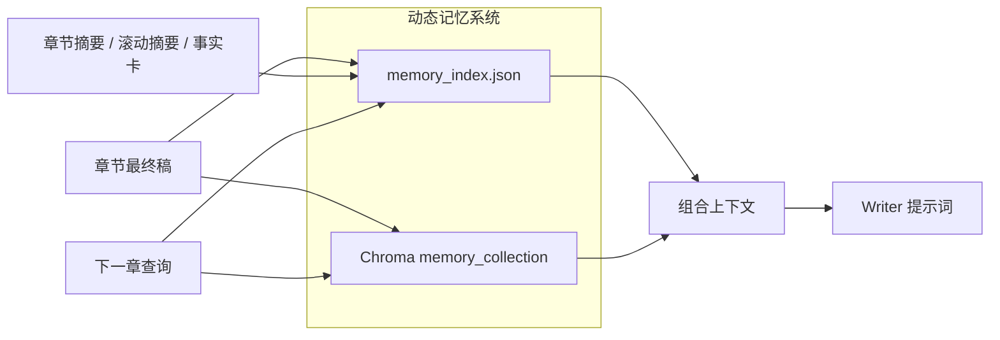

# CoLong Idea Studio

<div align="center">

**面向长篇创意文本的协同式、动态记忆优先创作框架**


</div>

## 摘要

`CoLong Idea Studio` 是一个面向长篇创意文本创作的协同式系统，用于统一处理创意澄清、全局大纲、章节生成与动态记忆管理。该项目的出发点很明确：在长篇写作中，用户往往只有一个“有潜力但不够完整”的 idea，如果模型过早开始写作，就容易出现结构漂移、人物失稳、章节节奏失控等问题。

为此，系统引入两类核心机制：

- **协同式创意 Agent**：先与用户多轮交互，持续追问和澄清，直到用户确认创意可以进入正式创作；
- **动态记忆优先生成流水线**：在写作过程中持续维护大纲、摘要、人物卡、世界观、情节点与事实卡片，作为后续章节的主要约束来源。

当前实现重点强调用户在环控制、过程可观测性、基于大纲的章节约束，以及适合部署的最小化运行模式。

---

## 研究动机

长篇生成系统经常失败，通常源于三类问题：

1. 初始提示过于粗糙，无法支撑小说级别的结构复杂度。
2. 仅依赖静态检索，无法维护持续演化的故事状态。
3. 自动评分会偏向局部最优，而削弱“完成整本书”的可控性。

`CoLong Idea Studio` 的核心假设是：**在生成长文本之前，系统应该先与用户共同完善创意规格**。当用户确认创意成熟后，系统再进入基于动态记忆的长篇写作，而不是由评分机制决定何时停下。

---

## 核心贡献

1. **将协同式创意澄清前置到生成之前**
   - 引入独立的协同式创意 Agent，用于多轮澄清与定稿。
   - 结束条件不是固定轮数，而是用户显式确认。

2. **采用动态记忆优先的长文本生成策略**
   - 将动态 memory 作为主知识底座，而不是依赖静态 RAG。
   - 持续保存大纲、章节摘要、事实卡、人物设定、世界观设定等结构化信息。

3. **基于大纲的章节约束机制**
   - 优先从章节大纲或全局大纲中解析长度区间。
   - 将长度要求直接注入写作提示词，而不是仅依赖环境变量硬编码。

4. **完成优先而非评分优先的执行策略**
   - 移除主章节循环中的评分停机逻辑。
   - 章节越界时记录 warning，而不是强制进入补写/重写回合。

5. **面向部署的可观测工作流**
   - 使用 `progress.log` 与 worker log 作为一等运行信号。
   - 在 Web 门户中展示 memory 快照、章节进度与实时日志。

---

## 系统总览





---

## 协同式创意 Agent

协同式创意阶段不是简单的前端补充表单，而是一个明确的 Agent 阶段。

### 目标

该 Agent 的目标是把“尚不完整的用户创意”逐步打磨为“可直接进入长篇写作的创作规格”，重点围绕：

- 核心冲突；
- 主角动机；
- 人物关系结构；
- 世界规则与题材边界；
- 篇幅、节奏与风格预期。

### 交互策略

- 每轮返回：`analysis`、`refined_idea`、`questions`、`readiness`、`ready_hint`。
- 轮数**不固定**。
- 结束条件不是内部阈值，而是**用户显式确认**。

### 设计意义

这种设计把创意构建从“隐式预处理”变成了“可见、可控、可协商”的协同过程。用户保留主导权，而模型负责补全结构缺口与叙事约束。

---

## 方法设计

### 章节长度区间推断

对第 `t` 章，系统按以下优先级确定长度范围：

1. 优先解析章节大纲中的显式长度区间。
2. 若章节大纲缺失，则解析全局大纲中的显式长度区间。
3. 若仍然没有，则回退到 `0.9 * chapter_target` 到 `1.12 * chapter_target`。

可识别表达包括：

- `3200-3600字`
- `3200~3600字`
- `每章约3300字`

### 动态上下文构建

写作提示上下文主要由以下部分组成：

1. 滚动摘要；
2. 最近章节摘要；
3. 最近事实卡片；
4. 动态 memory 向量检索结果；
5. 人物、世界观、大纲等结构化信息分组。

### 完成优先生成策略

主章节循环不以评分是否达标作为终止条件。若章节长度超出预期区间，系统只记录 `chapter_length_warning`，而不将其直接视为必须补写或重写的触发器。

---

## 日志与可观测性

`progress.log` 路径：

```text
runs/<run_id>/progress.log
```

典型事件包括：

- `global_outline`
- `chapter_outline_ready`
- `chapter_plan`
- `chapter_outline`
- `chapter_length_plan`
- `chapter_length_warning`
- `character_setting`
- `world_setting`
- `memory_snapshot`

Web 门户同时暴露实时 worker 输出、章节结果与 memory 计数，便于部署后的运行监控。

---

## 页面展示结构

部署后的页面被拆分为三个界面层级：

1. **Dashboard**
   - provider 管理；
   - 直接任务创建；
   - 协同式创意入口；
   - session 与 job 总览。

2. **协同式创意页面**
   - 原始创意；
   - 当前定稿草案；
   - 本轮分析；
   - 下一轮问题；
   - 用户确认入口。

3. **生成监控页面**
   - 实时 worker 输出；
   - 结构化 progress log；
   - 章节结果快照；
   - 运行进度与 memory 状态。

这种拆分体现的是一个明确的方法论：创意协同、长篇生成与过程监控应当被视为三个互相关联但职责不同的阶段。

---

## 运行画像

| 配置项 | 默认值 | 含义 |
|---|---|---|
| `MEMORY_ONLY_MODE` | `1` | 仅动态记忆运行模式 |
| `ENABLE_RAG` | `0` | 关闭静态/通用 RAG |
| `ENABLE_STATIC_KB` | `0` | 关闭静态知识库 |
| `ENABLE_EVALUATOR` | `0` | 默认关闭评估器 |
| `MIN_CHAPTER_CHARS` | `3000` | 回退下限 |
| `MAX_CHAPTER_CHARS` | `0` | 不设全局硬上限 |

---

## 项目结构

```text
.
├─ agents/                  # 协同式与生成式 Agent
├─ workflow/                # analyzer / organizer / executor
├─ rag/                     # 动态记忆与检索
├─ utils/                   # llm client 与辅助工具
├─ local_web_portal/        # 多用户 FastAPI 门户
├─ config.py                # 运行配置
└─ main.py                  # CLI 入口
```

---

## 快速启动

### CLI

```bash
python -m venv .venv
# Windows
.venv\Scripts\activate
# Linux/macOS
# source .venv/bin/activate

python -m pip install --upgrade pip
python -m pip install -r requirements.txt
python main.py
```

### Web 门户

```bash
python -m pip install -r requirements.txt
python -m pip install -r local_web_portal/requirements.txt
# Windows
copy local_web_portal\.env.example local_web_portal\.env
# Linux/macOS
# cp local_web_portal/.env.example local_web_portal/.env
python -m uvicorn local_web_portal.app.main:app --host 0.0.0.0 --port 8010
```

---

## 部署原则

建议采用严格白名单上传，并显式排除：

- `runs/*`
- `vector_db/*`
- `vector_db_tmp/*`
- `local_web_portal/data/*`
- `.venv/*`
- `__pycache__/*`

这样可以提升部署可复现性、降低体积，并减少共享环境下的数据泄露风险。

---

## 局限性

1. 提示词级长度控制仍然是概率性的，而不是数学硬约束。
2. 动态记忆的有效性依赖摘要质量与检索相关性。
3. 协同式创意阶段提升了控制力，但不能完全消除后续模型波动。
4. 章节轮次之间的时延仍会受到一致性检查、摘要生成与向量写入的影响。

---

## 引用

```bibtex
@software{colong_idea_studio_2026,
  title        = {CoLong Idea Studio: A Collaborative Dynamic-Memory-First Framework for Long-Form Creative Ideation and Story Generation},
  author       = {xiao-zi-chen and contributors},
  year         = {2026},
  url          = {https://github.com/xiao-zi-chen/Long-Story-agent}
}
```
